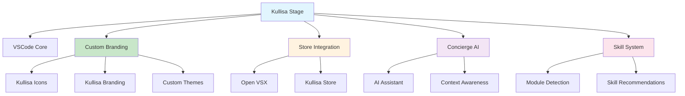
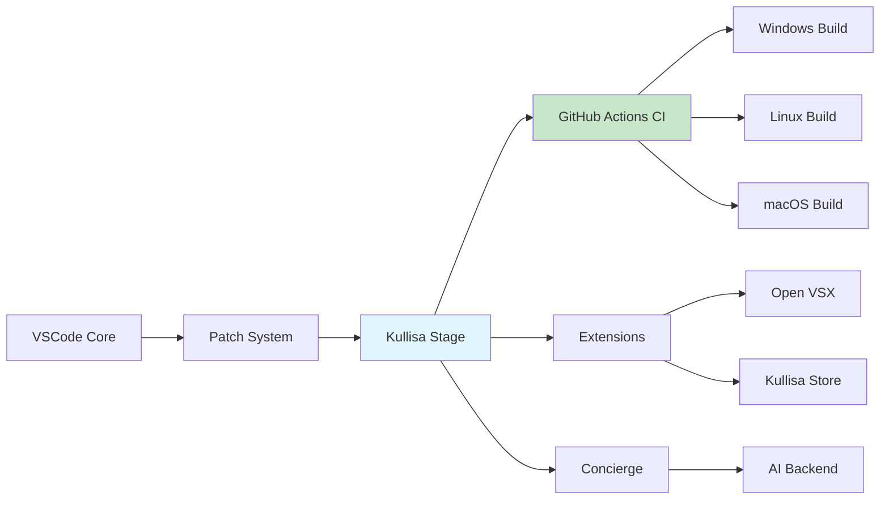
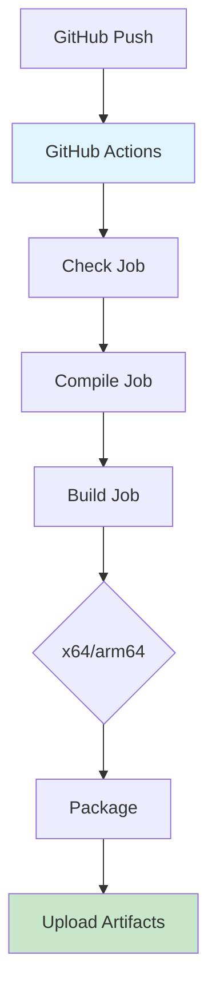
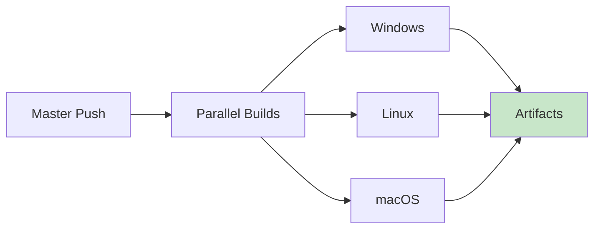
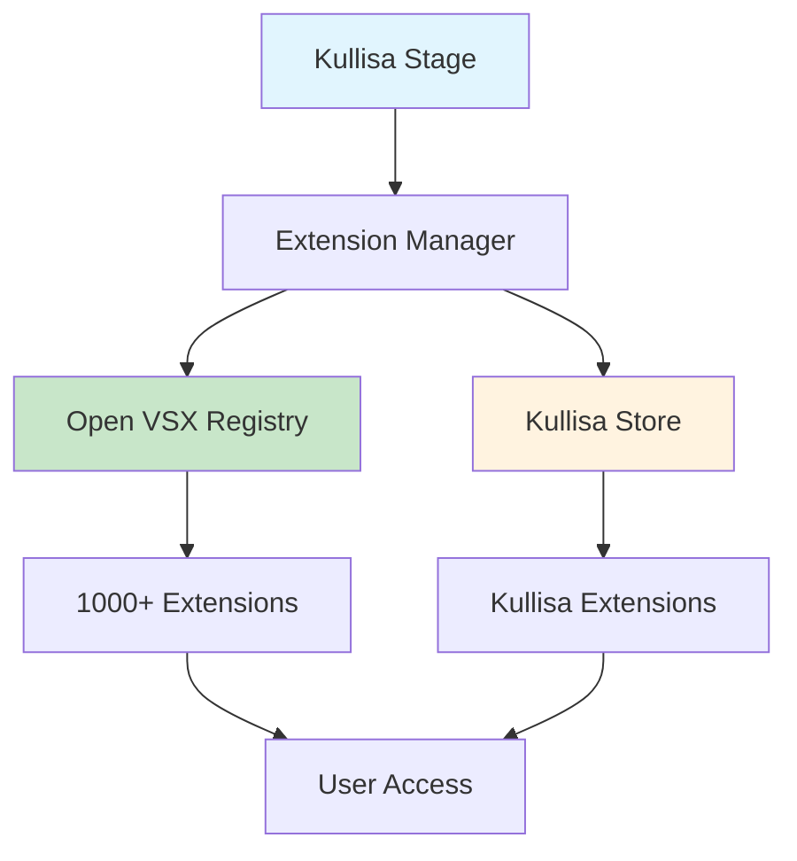

# Kullisa Stage - Projekt Index

## Projektübersicht

**Kullisa Stage** ist eine gebrandete Desktop-IDE-Plattform basierend auf VSCodium (einem VSCode-Fork). Das Projekt transformiert VSCodium in eine vollständig gebrandete Kullisa-Anwendung mit integriertem Store, Concierge-Assistent und modularem Skill-System.



---

## Projektstruktur

### Verzeichnisübersicht

```
Kullisa-Stage/
├── .github/workflows/          # GitHub Actions CI/CD
│   ├── stable-windows.yml     # Windows Stable Build
│   ├── stable-linux.yml       # Linux Stable Build
│   ├── stable-macos.yml       # macOS Stable Build
│   ├── insider-*.yml          # Insider/Preview Builds
├── patches/                    # VSCodium Patches
│   ├── brand.patch            # Haupt-Branding-Patch
│   ├── telemetry.patch        # Telemetrie-Deaktivierung
│   ├── disable-*.patch        # Verschiedene Deaktivierungen
│   ├── *.disabled             # Deaktivierte Patches
├── icons/                      # Kullisa Icons
│   ├── stable/                # Stable Icons
│   └── insider/               # Insider Icons
├── docs/                       # Dokumentation
│   ├── INDEX.md               # Diese Datei
│   ├── PLAN.md                # Projektplan
│   └── ICONS.md               # Icon-Dokumentation
├── build/                      # Build-Skripte
├── dev/                        # Development Tools
├── src/                        # Source-Overlays
└── vscode/                     # VSCode Source (cloned)
```

---

## Architektur

### System-Architektur



### Build-Prozess



---

## Branding-Konfiguration

### Variablen

Alle Branding-Variablen sind in `utils.sh` und den GitHub Actions Workflows definiert:

| Variable | Wert | Beschreibung |
|----------|------|--------------|
| `APP_NAME` | Kullisa Stage | Anzeigename der Anwendung |
| `BINARY_NAME` | kullisa | Name der ausführbaren Datei |
| `ORG_NAME` | KullisaLabs | Organisation/Publisher |
| `GH_REPO_PATH` | KullisaLabs/kullisa-desktop | GitHub Repository |

### Geänderte Dateien

| Datei | Änderung | Status |
|-------|----------|--------|
| `utils.sh` | Branding-Variablen | ✅ Aktualisiert |
| `.github/workflows/*.yml` | CI/CD Branding | ✅ Aktualisiert |
| `icons/stable/*` | Kullisa Icons | ✅ Ersetzt |
| `icons/insider/*` | Kullisa Insider Icons | ✅ Ersetzt |
| `patches/brand.patch` | Haupt-Branding | ✅ Angewendet |

---

## Patches

### Aktive Patches

| Patch | Zweck | Status |
|-------|-------|--------|
| `brand.patch` | Haupt-Branding (Namen, Icons) | ✅ Aktiv |
| `telemetry.patch` | Telemetrie deaktivieren | ✅ Aktiv |
| `disable-cloud.patch` | Cloud-Sync deaktivieren | ✅ Aktiv |
| `disable-copilot.patch` | Copilot deaktivieren | ✅ Aktiv |
| `fix-gallery.patch` | Extension Gallery fix | ✅ Aktiv |
| `cli.patch` | CLI-Anpassungen | ✅ Aktiv |

### Deaktivierte Patches

| Patch | Grund | Priorität |
|-------|-------|-----------|
| `add-remote-url.patch` | Hardcodierte Version | Niedrig |
| `binary-name.patch` | Konflikt mit VSCode 1.110.1 | Mittel |
| `default-light-theme.patch` | Nicht kompatibel | Niedrig |

### Patch-Anwendung

```bash
# Patches werden automatisch angewendet durch prepare_vscode.sh
cd vscode
git apply ../patches/*.patch
```

---

## CI/CD - GitHub Actions

### Workflows

| Workflow | Plattform | Trigger | Status |
|----------|-----------|---------|--------|
| `stable-windows.yml` | Windows | Push zu master | ✅ Konfiguriert |
| `stable-linux.yml` | Linux | Push zu master | ✅ Konfiguriert |
| `stable-macos.yml` | macOS | Push zu master | ✅ Konfiguriert |
| `insider-windows.yml` | Windows | Push zu insider | ✅ Konfiguriert |
| `insider-linux.yml` | Linux | Push zu insider | ✅ Konfiguriert |
| `insider-macos.yml` | macOS | Push zu insider | ✅ Konfiguriert |

### Build-Status



### Bekannte Issues

- **Signing**: Deaktiviert für Development-Builds (fehlende SignPath Secrets)
- **winget**: Nicht konfiguriert für Kullisa Branding

---

## Store-Integration

### Strategie: Dual-Store



### Open VSX

- **URL**: https://open-vsx.org
- **Status**: Noch nicht konfiguriert
- **Plan**: Als primären Store einrichten

### Kullisa Store

- **Status**: In Entwicklung (lokal)
- **Plan**: Parallel aufbauen, später prominent machen
- **Vorteile**: Eigene Extensions, volle Kontrolle

### Extension-Filter

**Blocklist** (geplant):
- Microsoft-Extensions (`ms-*`)
- Konkurrenz-Produkte
- Potenziell unsichere Extensions

**Curated List** (geplant):
- Empfohlene Extensions für Kullisa
- Kategorien: Development, AI, Productivity

---

## Roadmap

### Phase 1: Branding & CI/CD ✅

- [x] VSCodium Struktur analysieren
- [x] Branding implementieren
- [x] Icons ersetzen
- [x] GitHub Actions einrichten
- [x] Erste Kompilierung erfolgreich
- [ ] Build testen (wartet auf Ergebnis)

### Phase 2: Store-Integration 🔄

- [ ] Open VSX konfigurieren
- [ ] Microsoft-Blocklist implementieren
- [ ] Kuratierte Empfehlungsliste erstellen
- [ ] Kullisa Store vorbereiten

### Phase 3: Concierge-Integration ⏳

- [ ] Concierge-Panel designen
- [ ] API-Integration planen
- [ ] Context-Awareness implementieren

### Phase 4: Modul- & Skill-Erkennung ⏳

- [ ] Projekt-Scanner entwickeln
- [ ] Skill-Empfehlungen
- [ ] Automatische Konfiguration

### Phase 5: Installer & Updates ⏳

- [ ] Windows Installer (MSI/NSIS)
- [ ] Auto-Update System
- [ ] Update-Server konfigurieren

---

## Wichtige Dateien

### Konfiguration

| Datei | Zweck |
|-------|-------|
| `product.json` | Produkt-Konfiguration |
| `utils.sh` | Build-Variablen |
| `prepare_vscode.sh` | VSCode-Vorbereitung |
| `upstream/stable.json` | VSCode-Version |

### Skripte

| Skript | Zweck |
|--------|-------|
| `get_repo.sh` | VSCode-Repository klonen |
| `build.sh` | Haupt-Build-Skript |
| `build/windows/package.sh` | Windows Packaging |

### Patches

| Patch | Beschreibung |
|-------|--------------|
| `patches/brand.patch` | Haupt-Branding |
| `patches/telemetry.patch` | Telemetrie-Deaktivierung |
| `patches/disable-*.patch` | Verschiedene Deaktivierungen |

---

## Entwicklungs-Workflow

### Lokale Entwicklung

```bash
# 1. Repository klonen
git clone https://github.com/BaronButter/Kullisa-Stage.git
cd Kullisa-Stage

# 2. VSCode Source holen
./get_repo.sh

# 3. Vorbereiten
./prepare_vscode.sh

# 4. Build starten (lokal - komplex)
cd vscode
npm install
npm run gulp vscode-win32-x64

# Empfohlen: GitHub Actions verwenden!
```

### GitHub Actions Workflow

```bash
# 1. Änderungen committen
git add .
git commit -m "[VSCODIUM-EXPERT] Beschreibung"

# 2. Push zu GitHub
git push origin master

# 3. Build verfolgen
# https://github.com/BaronButter/Kullisa-Stage/actions

# 4. Artifacts herunterladen (nach ~60 Minuten)
```

---

## Technische Details

### VSCode Version

- **Aktuell**: 1.110.1
- **Commit**: 61b3d0ab13be7dda2389f1d3e60a119c7f660cc3
- **Qualität**: Stable

### Node.js Version

- **Empfohlen**: >= 22.15.0
- **Aktuell in CI**: 22.12.0

### Build-Plattformen

| Plattform | Architektur | Status |
|-----------|-------------|--------|
| Windows | x64 | ✅ Konfiguriert |
| Windows | arm64 | ✅ Konfiguriert |
| Linux | x64 | ✅ Konfiguriert |
| Linux | arm64 | ✅ Konfiguriert |
| macOS | x64 | ✅ Konfiguriert |
| macOS | arm64 | ✅ Konfiguriert |

---

## Ressourcen

### Links

- **Repository**: https://github.com/BaronButter/Kullisa-Stage
- **GitHub Actions**: https://github.com/BaronButter/Kullisa-Stage/actions
- **VSCodium**: https://vscodium.com
- **Open VSX**: https://open-vsx.org

### Dokumentation

- `docs/PLAN.md` - Detaillierter Projektplan
- `docs/ICONS.md` - Icon-Generierung und -Austausch
- `CUSTOMIZATION.md` - VSCodium Customization Guide
- `docs/howto-build.md` - Build-Anleitung

---

## Team & Kontakt

**Organisation**: KullisaLabs  
**Projekt**: Kullisa Stage  
**Repository**: https://github.com/BaronButter/Kullisa-Stage

---

## Änderungshistorie

| Datum | Änderung | Autor |
|-------|----------|-------|
| 2025-03-15 | Erste Kompilierung erfolgreich | VSCODIUM-EXPERT |
| 2025-03-15 | GitHub Actions CI/CD eingerichtet | VSCODIUM-EXPERT |
| 2025-03-15 | Branding implementiert | VSCODIUM-EXPERT |
| 2025-03-15 | Icons ersetzt | VSCODIUM-EXPERT |

---

*Letzte Aktualisierung: 2025-03-15*  
*Version: 1.0.0-alpha*