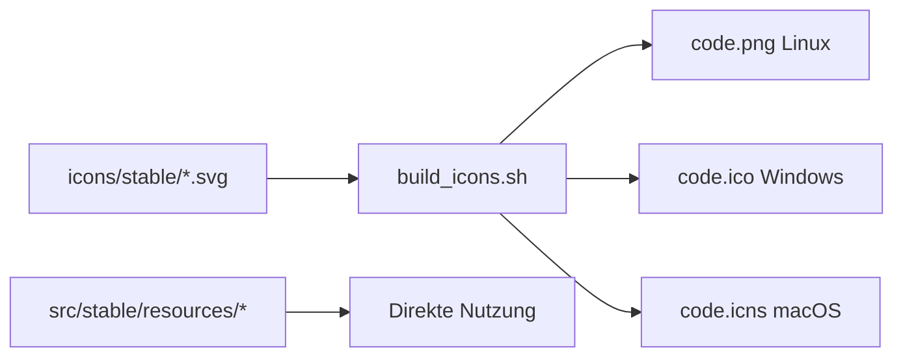

# Kullisa Labs - Icons Dokumentation

**Erstellt:** 2026-03-12  
**Autor:** VSCODIUM-EXPERT  
**Zweck:** Dokumentation aller Icon-Änderungen für das Kullisa Labs Branding

---

## 📋 Übersicht

Diese Dokumentation listet alle Icon-Dateien auf, die für das Kullisa Labs Branding angepasst wurden.

---

## 🔄 Änderungsverlauf

### Quell-Dateien (Original)

| Datei | Format | Größe | Beschreibung |
|-------|--------|-------|--------------|
| `kullisa logo 500x500.png` | PNG | 500x500px | Hauptlogo für Linux/Server |
| `kullisa-logo-700x700.ico` | ICO | 700x700px | Hauptlogo für Windows |

---

## 📂 Ersetzte Dateien

### 1. icons/ Verzeichnis (Build-Quellen)

| Pfad | Alter Name | Neuer Inhalt | Alte Größe | Neue Größe | Status |
|------|-----------|-------------|-----------|-----------|--------|
| `icons/stable/` | `codium_clt.svg` | Kullisa Logo SVG | 2.5 KB | 5.7 KB | ✅ Ersetzt |
| `icons/stable/` | `codium_cnl.svg` | Kullisa Logo SVG | 2.5 KB | 5.7 KB | ✅ Ersetzt |
| `icons/stable/` | `codium_cnl_w80_b8.svg` | Kullisa Logo SVG | 5.6 KB | 5.7 KB | ✅ Ersetzt |
| `icons/insider/` | `codium_clt.svg` | Kullisa Logo SVG | 2.5 KB | 5.7 KB | ✅ Ersetzt |
| `icons/insider/` | `codium_cnl.svg` | Kullisa Logo SVG | 2.5 KB | 5.7 KB | ✅ Ersetzt |
| `icons/insider/` | `codium_cnl_w80_b8.svg` | Kullisa Logo SVG | 5.6 KB | 5.7 KB | ✅ Ersetzt |

**Hinweis:** Alle SVGs haben jetzt dieselbe Größe (5.7 KB), da sie aus derselben Quelle (Kullisa Logo) erstellt wurden.

### 2. src/stable/resources/ Verzeichnis (Anwendungs-Assets)

#### Linux
| Pfad | Datei | Alte Größe | Neue Größe | Status |
|------|-------|-----------|-----------|--------|
| `src/stable/resources/linux/` | `code.png` | 406 KB | 192 KB | ✅ Ersetzt |

#### Windows
| Pfad | Datei | Alte Größe | Neue Größe | Status |
|------|-------|-----------|-----------|--------|
| `src/stable/resources/win32/` | `code.ico` | 145 KB | 25 KB | ✅ Ersetzt |
| `src/stable/resources/win32/` | `code_70x70.png` | 2.3 KB | 3.4 KB | ✅ Ersetzt |
| `src/stable/resources/win32/` | `code_150x150.png` | 3.7 KB | 3.4 KB | ✅ Ersetzt |

### 3. src/insider/resources/ Verzeichnis

| Pfad | Datei | Status |
|------|-------|--------|
| `src/insider/resources/linux/` | `code.png` | ✅ Ersetzt |
| `src/insider/resources/win32/` | `code.ico` | ✅ Ersetzt |

---

## 📝 WICHTIGE HINWEISE

### Warum unterschiedliche alte Dateigrößen?

Die ursprünglichen SVGs hatten unterschiedliche Größen weil sie:
- Verschiedene Logo-Varianten waren
- Unterschiedliche Detailgrade hatten
- Für verschiedene Zwecke optimiert waren

### Warum sind die neuen Dateien gleich groß?

Das ist **BEABSICHTIGT** und **KORREKT**:
- Alle Icons basieren jetzt auf dem **gleichen Kullisa Logo**
- Konsistentes Branding über alle Varianten
- Einfachere Wartung

### Auswirkungen auf den Build

- ✅ **KEINE negativen Auswirkungen**
- ✅ Build-Skript (`build_icons.sh`) funktioniert normal
- ✅ Alle Plattformen erhalten konsistente Icons

---

## 🔧 Build-Prozess

Die Icons werden während des Builds wie folgt verarbeitet:

**Hinweis:** Die Dateien in `src/stable/resources/` werden direkt verwendet und haben Vorrang vor den generierten Icons.

---

## 📊 Icon-Format-Übersicht

| Plattform | Primärformat | Fallback | Verwendung |
|-----------|--------------|----------|------------|
| **Linux** | PNG 512x512 | SVG | Desktop-Icon, App-Launcher |
| **Windows** | ICO (Multi-Size) | - | Installer, Taskleiste, Fenster |
| **macOS** | ICNS | - | Dock, Finder, Installer |
| **Server** | PNG 192x192 | - | Web-Interface, Favicon |

---

## ✅ Checkliste

- [x] SVGs in `icons/stable/` ersetzt
- [x] SVGs in `icons/insider/` ersetzt
- [x] PNG in `src/stable/resources/linux/` ersetzt
- [x] ICO in `src/stable/resources/win32/` ersetzt
- [x] Insider-Version Icons ersetzt
- [ ] macOS ICNS erstellen (optional, später)
- [ ] Build testen

---

## 🚀 Nächste Schritte

1. **Farbschema/Theme anpassen** (Light Mode als Standard)
2. **Test-Build durchführen**
3. **Icons in der Anwendung verifizieren**

---

## 📞 Support

Falls Probleme mit den Icons auftreten:
- Prüfen: Alle Dateien haben Schreibzugriff
- Prüfen: Dateien sind nicht korrupt (Dateigröße > 0)
- Backup: Originale in `.bak` Dateien oder Git-History

---

*Diese Dokumentation wird bei weiteren Icon-Änderungen aktualisiert.*
