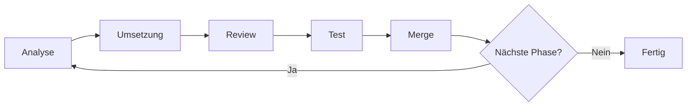

# Kullisa Desktop - Mehrphasiger Entwicklungsplan

**Erstellt:** 2026-03-12  
**Autor:** VSCODIUM-EXPERT  
**Status:** Phase 0 - Analyse & Planung

---

## 📊 Übersicht

```mermaid
flowchart LR
    subgraph P0[Phase 0]
        A1[Analyse]
        A2[Planung]
        A3[Dokumentation]
    end
    
    subgraph P1[Phase 1]
        B1[Branding]
        B2[Icons]
        B3[Farbschema]
    end
    
    subgraph P2[Phase 2]
        C1[Store-Integration]
        C2[Extension Gallery]
    end
    
    subgraph P3[Phase 3]
        D1[Concierge]
        D2[Assistenten]
    end
    
    subgraph P4[Phase 4]
        E1[Pre-Installed Addons]
        E2[Modul-Erkennung]
    end
    
    subgraph P5[Phase 5]
        F1[Installer]
        F2[Update-System]
    end
    
    P0 --> P1 --> P2 --> P3 --> P4 --> P5
```



---

## 🔍 Phase 0: Analyse & Planung (AKTUELL)

### Ziele:
- Vollständige Analyse der VSCodium-Codebasis
- Identifikation aller Branding-relevanten Dateien
- Erstellung der Index-Dokumentation
- Definition der weiteren Phasen

### Aufgaben:
- [x] Repository-Struktur analysieren
- [x] Wichtige Konfigurationsdateien identifizieren
- [x] product.json analysieren
- [x] patches/ Verzeichnis analysieren
- [x] src/ Verzeichnis analysieren
- [x] Build-Skripte verstehen
- [x] icons/ Verzeichnis analysieren
- [x] Index-Dokumentation erstellen
- [ ] Plan mit Team reviewen
- [ ] Plan finalisieren

### Deliverables:
- [`docs/INDEX.md`](./INDEX.md) - Repository-Übersicht
- [`docs/PLAN.md`](./PLAN.md) - Dieser Plan

---

## 🎨 Phase 1: Branding

### Ziele:
- Produktname zu "Kullisa Labs" ändern
- Logo und Icons ersetzen
- Farbschema anpassen
- Light Mode als Standard

### Aufgaben:

#### 1.1 Branding-Variablen
- [ ] `utils.sh` anpassen:
  - `APP_NAME="Kullisa Labs"`
  - `BINARY_NAME="kullisa"`
  - `ORG_NAME="KullisaLabs"`
  - `GH_REPO_PATH="KullisaLabs/kullisa-desktop"`

#### 1.2 Produkt-Konfiguration
- [ ] `prepare_vscode.sh` anpassen:
  - `nameShort` → "Kullisa Labs"
  - `nameLong` → "Kullisa Labs"
  - `applicationName` → "kullisa"
  - `linuxIconName` → "kullisa"
  - `urlProtocol` → "kullisa"
  - Alle Windows/macOS-spezifischen Werte

#### 1.3 Icons & Logos
- [ ] Kullisa Labs Logo erstellen (SVG)
- [ ] `icons/stable/codium_cnl.svg` ersetzen
- [ ] `icons/insider/codium_cnl.svg` ersetzen
- [ ] Icon-Build ausführen (`build_icons.sh`)
- [ ] Alle Plattform-Icons in `src/stable/resources/` aktualisieren

#### 1.4 Farbschema
- [ ] Standard-Theme auf Light Mode setzen
- [ ] Kullisa-Farben definieren (Primär, Sekundär, Akzent)
- [ ] Workbench-Farben anpassen (falls nötig)

### Deliverables:
- Gebrandete Binärdateien
- Kullisa Labs Icons für alle Plattformen
- Light Mode als Standard

---

## 🏪 Phase 2: Store-Integration

### Ziele:
- Eigenen Extension Store integrieren
- Extension Gallery URL anpassen
- Store-Backend vorbereiten

### Aufgaben:

#### 2.1 Extension Gallery
- [ ] `prepare_vscode.sh` - Gallery URL ändern:
  ```bash
  setpath_json "product" "extensionsGallery" '{
    "serviceUrl": "https://store.kullisa.com/api/vscode/gallery",
    "itemUrl": "https://store.kullisa.com/api/vscode/item"
  }'
  ```
- [ ] `linkProtectionTrustedDomains` erweitern

#### 2.2 Store-Backend
- [ ] API-Endpunkte definieren
- [ ] Extension-Metadaten-Format
- [ ] Authentifizierung konzipieren

#### 2.3 Pre-Installed Extensions
- [ ] Liste der vorzuinstallierenden Extensions definieren
- [ ] Extensions in Build integrieren

### Deliverables:
- Funktionierender Kullisa Extension Store
- Pre-Installed Extensions

---

## 🤖 Phase 3: Concierge & Assistenten

### Ziele:
- Concierge-Integration vorbereiten
- Assistenten-API einbauen
- Gateway-Verbindung konfigurieren

### Aufgaben:

#### 3.1 Concierge Integration
- [ ] Concierge-Service identifizieren
- [ ] API-Endpunkte definieren
- [ ] UI-Integration planen

#### 3.2 Gateway-Verbindung
- [ ] Gateway-URL konfigurieren
- [ ] Authentifizierung implementieren
- [ ] Datenbank-Anbindung

#### 3.3 Assistenten
- [ ] Assistenten-API definieren
- [ ] UI-Komponenten planen
- [ ] Skill-Erkennung implementieren

### Deliverables:
- Concierge-Integration
- Assistenten-Funktionalität
- Gateway-Verbindung

---

## 📦 Phase 4: Module & Skills

### Ziele:
- Modul-Erkennung implementieren
- Skill-Erkennung implementieren
- Pre-Installed Addons integrieren

### Aufgaben:

#### 4.1 Modul-Erkennung
- [ ] Modul-Format definieren
- [ ] Erkennungs-Logik implementieren
- [ ] UI für Module

#### 4.2 Skill-Erkennung
- [ ] Skill-Format definieren
- [ ] Erkennungs-Logik implementieren
- [ ] UI für Skills

#### 4.3 Pre-Installed Addons
- [ ] Addon-Liste definieren
- [ ] Installations-Workflow
- [ ] Update-Mechanismus

### Deliverables:
- Modul-System
- Skill-System
- Pre-Installed Addons

---

## 🚀 Phase 5: Installer & Updates

### Ziele:
- Windows Installer erstellen
- macOS DMG erstellen
- Linux Packages erstellen
- Auto-Update-System

### Aufgaben:

#### 5.1 Windows
- [ ] Inno Setup Script anpassen
- [ ] Code Signing vorbereiten
- [ ] Windows Store Package (optional)

#### 5.2 macOS
- [ ] DMG erstellen
- [ ] Code Signing
- [ ] Notarisierung

#### 5.3 Linux
- [ ] .deb Package
- [ ] .rpm Package
- [ ] AppImage
- [ ] Snap Package

#### 5.4 Update-System
- [ ] Update-Server konfigurieren
- [ ] Auto-Update Mechanismus
- [ ] Release-Channel (stable/insider)

### Deliverables:
- Installer für alle Plattformen
- Auto-Update-System
- Release-Pipeline

---

## 📈 Iterationsprozess

Jede Phase durchläuft folgenden Zyklus:



---

## 📝 Code-Kommentar-Richtlinie

Alle Änderungen müssen mit folgendem Kommentar versehen werden:

```typescript
/*
  Author: VSCODIUM-EXPERT
  Date: YYYY-MM-DD
  Time: HH:MM CET
  Description: <Was wurde geändert und warum>
*/
```

Kurzkommentar:
```typescript
// [VSCODIUM-EXPERT | YYYY-MM-DD HH:MM] <Beschreibung>
```

---

## 📋 Commit-Richtlinie

```
[VSCODIUM-EXPERT] <Kurze Beschreibung>
```

Beispiele:
```
[VSCODIUM-EXPERT] Branding: APP_NAME zu Kullisa Labs geändert
[VSCODIUM-EXPERT] Icons: Kullisa Labs Logo hinzugefügt
[VSCODIUM-EXPERT] Store: Extension Gallery URL angepasst
```

---

## ⚠️ Risiken & Abhängigkeiten

| Risiko | Wahrscheinlichkeit | Auswirkung | Mitigation |
|--------|-------------------|------------|------------|
| Build schlägt fehl | Mittel | Hoch | Incrementelle Änderungen, häufige Tests |
| Patch-Konflikte | Mittel | Mittel | Patches sorgfältig prüfen |
| Icon-Format-Probleme | Niedrig | Mittel | Alle Formate testen |
| Store-Integration komplex | Hoch | Mittel | API frühzeitig testen |

---

## 📅 Nächste Schritte

1. **Plan reviewen** - Mit Team besprechen
2. **Phase 1 starten** - Nach Freigabe
3. **Test-Build** - Ersten Build mit Branding testen
4. **Iterieren** - Bis alle Anforderungen erfüllt

---

*Dieser Plan wird während der Entwicklung kontinuierlich aktualisiert.*
