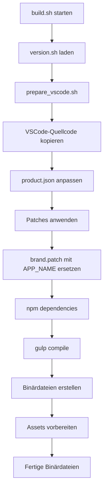

# VSCodium Repository Index

**Erstellt:** 2026-03-12  
**Autor:** VSCODIUM-EXPERT  
**Zweck:** Übersicht über die VSCodium-Codebasis für Kullisa Labs Fork

---

## 📁 Repository-Struktur

```
Kullisa-Stage/
├── product.json              # Extension-Konfigurationen (nicht für Branding)
├── build.sh                  # Haupt-Build-Skript
├── prepare_vscode.sh         # VSCode-Quellcode vorbereiten & Branding setzen
├── utils.sh                  # Gemeinsame Funktionen & Branding-Variablen
├── version.sh                # Versionsverwaltung
│
├── patches/                  # Patch-Dateien für VSCode-Quellcode
│   ├── brand.patch           # ⭐ ZENTRALE BRANDING-DATEI (142KB)
│   ├── binary-name.patch     # Binärdateinamen
│   ├── cli.patch             # CLI-Anpassungen
│   ├── disable-*.patch       # Deaktivierungen (Copilot, Telemetry, etc.)
│   ├── telemetry.patch       # Telemetrie-Entfernung
│   ├── linux/                # Linux-spezifische Patches
│   ├── windows/              # Windows-spezifische Patches
│   ├── osx/                  # macOS-spezifische Patches
│   └── user/                 # Benutzer-definierte Patches
│
├── src/                      # Quellcode-Overrides
│   ├── stable/               # Stable-Version
│   │   ├── resources/        # Plattform-spezifische Ressourcen
│   │   │   ├── darwin/       # macOS Icons (.icns)
│   │   │   ├── linux/        # Linux Icons (.png, .svg, .desktop)
│   │   │   ├── win32/        # Windows Icons (.ico, .bmp)
│   │   │   └── server/       # Server-Assets
│   │   └── src/vs/workbench/ # Workbench-Overrides
│   └── insider/              # Insider-Version (gleiche Struktur)
│
├── icons/                    # Logo-Assets für Build
│   ├── build_icons.sh        # Icon-Build-Skript
│   ├── stable/               # Stable-Logos
│   │   ├── codium_cnl.svg    # Hauptlogo
│   │   ├── codium_clt.svg    # Alternatives Logo
│   │   └── codium_cnl_w80_b8.svg
│   └── insider/              # Insider-Logos
│
├── stores/                   # Store-Integrationen
│   ├── snapcraft/            # Linux Snap Store
│   └── winget/               # Windows Winget
│
├── docs/                     # Dokumentation
├── dev/                      # Entwicklungs-Tools
└── upstream/                 # VSCode-Upstream-Referenzen
```

---

## 🔑 Wichtige Dateien für Branding

### 1. `utils.sh` - Branding-Variablen

```bash
APP_NAME="${APP_NAME:-VSCodium}"           # Anzeigename
APP_NAME_LC="$(echo "${APP_NAME}" | awk '{print tolower($0)}')"  # Kleinschreibung
BINARY_NAME="${BINARY_NAME:-codium}"       # Binärdateiname
GH_REPO_PATH="${GH_REPO_PATH:-VSCodium/vscodium}"  # GitHub-Pfad
ORG_NAME="${ORG_NAME:-VSCodium}"           # Organisationsname
```

### 2. `prepare_vscode.sh` - Produkt-Konfiguration

**Stable-Version (Zeilen 103-130):**
```bash
setpath "product" "nameShort" "VSCodium"
setpath "product" "nameLong" "VSCodium"
setpath "product" "applicationName" "codium"
setpath "product" "linuxIconName" "vscodium"
setpath "product" "urlProtocol" "vscodium"
setpath "product" "win32DirName" "VSCodium"
# ... weitere Windows/macOS-spezifische Einstellungen
```

**Insider-Version (Zeilen 75-102):**
```bash
setpath "product" "nameShort" "VSCodium - Insiders"
setpath "product" "nameLong" "VSCodium - Insiders"
setpath "product" "applicationName" "codium-insiders"
# ... weitere Einstellungen
```

### 3. `patches/brand.patch` - Text-Ersetzungen

Ersetzt alle "VS Code" Referenzen durch `!!APP_NAME!!` Platzhalter:
- UI-Texte
- Dokumentation
- Fehlermeldungen
- Hilfetexte

---

## 🔄 Build-Prozess



---

## 🎨 Branding-Anpassung für Kullisa Labs

### Was geändert werden muss:

| Datei | Änderung |
|-------|----------|
| `utils.sh` | `APP_NAME="Kullisa Labs"` |
| `utils.sh` | `BINARY_NAME="kullisa"` |
| `utils.sh` | `ORG_NAME="KullisaLabs"` |
| `utils.sh` | `GH_REPO_PATH="KullisaLabs/kullisa-desktop"` |
| `prepare_vscode.sh` | Alle "VSCodium" → "Kullisa Labs" |
| `prepare_vscode.sh` | Alle "codium" → "kullisa" |
| `icons/stable/codium_cnl.svg` | Kullisa Labs Logo |
| `src/stable/resources/` | Alle Icons ersetzen |

### Extension Gallery URL:

```bash
# Aktuell: Open VSX Registry
setpath_json "product" "extensionsGallery" '{"serviceUrl": "https://open-vsx.org/vscode/gallery", ...}'

# Für Kullisa Store:
setpath_json "product" "extensionsGallery" '{"serviceUrl": "https://store.kullisa.com/api/vscode/gallery", ...}'
```

---

## 📋 Patch-Übersicht

| Patch | Zweck | Größe |
|-------|-------|-------|
| `brand.patch` | Alle Markennamen ersetzen | 142KB |
| `binary-name.patch` | Binärdateinamen | 1.6KB |
| `cli.patch` | CLI-Anpassungen | 12KB |
| `disable-copilot.patch` | Copilot entfernen | 9.4KB |
| `disable-cloud.patch` | Cloud-Features deaktivieren | 3.1KB |
| `telemetry.patch` | Telemetrie entfernen | 4KB |
| `fix-gallery.patch` | Extension Gallery Fix | 2.2KB |

---

## 🖼️ Icon-Struktur

### Erforderliche Formate:

| Plattform | Format | Speicherort |
|-----------|--------|-------------|
| Windows | .ico, .bmp | `src/stable/resources/win32/` |
| macOS | .icns | `src/stable/resources/darwin/` |
| Linux | .png, .svg | `src/stable/resources/linux/` |
| Server | .png, .ico | `src/stable/resources/server/` |

### Icon-Build:

```bash
cd icons/
./build_icons.sh  # Erstellt alle Formate aus SVG
```

---

## ⚠️ Wichtige Hinweise

1. **Keine Code-Änderungen in Phase 0** - Nur Analyse und Planung
2. **Build dauert 1-2 Stunden** - Alle Änderungen vor Build fertigstellen
3. **Patches sind sensibel** - Genaue Zeilennummern beachten
4. **Icons müssen alle Formate abdecken** - Sonst Fehler im Build

---

## 📚 Weiterführende Dokumentation

- [`CUSTOMIZATION.md`](../CUSTOMIZATION.md) - Vorläufige Anpassungsübersicht
- [`README.md`](../README.md) - VSCodium README
- [`CONTRIBUTING.md`](../CONTRIBUTING.md) - Beitragen zum Projekt

---

*Diese Index-Datei wird während der Analyse kontinuierlich erweitert.*
