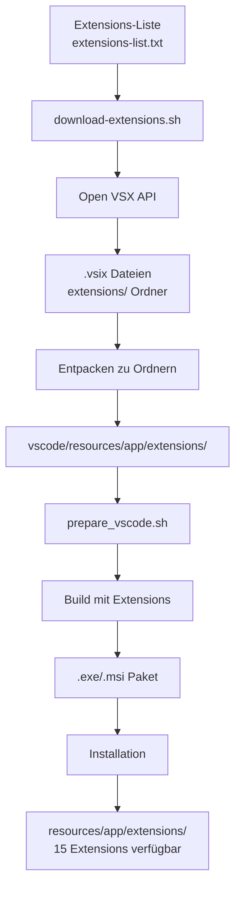

# Extensions-Vorinstallations-Plan

**Datum:** 2026-03-24  
**Status:** Entwurf - zur Genehmigung durch Benutzer

---

## 📋 Zusammenfassung

Extensions als "builtin" im Programm-Ordner vorinstallieren, sodass sie nach der Installation sofort verfügbar sind.

---

## 🔍 Analyse der aktuellen Situation

### Build-Ablauf (vereinfacht):
```
prepare_vscode.sh → kopiert src/ nach vscode/
                → wendet Patches an
                → npm ci installiert Abhängigkeiten
                
build.sh → kompiliert VSCode
       → erstellt .exe/.msi Paket
```

### Extensions-Zielordner im installierten System:
```
C:\Program Files\Kullisa\resources\app\extensions\
├── saudrizwan.claude-dev\
├── eamodio.gitlens\
└── ... (15 Extensions total)
```

### 15 geplante Extensions (aus CUSTOMIZATION.md):
1. `saoudrizwan.claude-dev` - Claude Dev
2. `eamodio.gitlens` - GitLens
3. `alefragnani.project-manager` - Project Manager
4. `yzhang.markdown-all-in-one` - Markdown All in One
5. `yzane.markdown-pdf` - Markdown PDF
6. `streetsidesoftware.code-spell-checker` - Code Spell Checker
7. `bierner.markdown-mermaid` - Mermaid Preview
8. `hediet.vscode-drawio` - Draw.io Integration
9. `cweijan.vscode-office` - Office Viewer
10. `grapecity.gc-excelviewer` - Excel Viewer
11. `kisstkondoros.vscode-gutter-preview` - Image Preview
12. `gruntfuggly.todo-tree` - Todo Tree
13. `humao.rest-client` - REST Client
14. `pkief.material-icon-theme` - Material Icon Theme
15. `ms-toolsai.jupyter` - Jupyter

---

## 🎯 Lösungsansatz

### Option A: Extensions in `prepare_vscode.sh` kopieren

Extensions werden VOR dem Kompilieren nach `vscode/resources/app/extensions/` kopiert.

**Vorteile:**
- ✅ Einfach umzusetzen
- ✅ Funktioniert bei portablem Modus
- ✅ Extensions sind als "builtin" verfügbar

**Nachteile:**
- ❌ Build-Prozess wird verlängert
- ❌ Erhöht die Paketgröße

### Implementierung:

```bash
# In prepare_vscode.sh (nach Zeile 10, nach cp src/*)

# Extensions vorinstallieren
EXTENSIONS_DIR="extensions"
if [ -d "${EXTENSIONS_DIR}" ]; then
  echo "Kopiere vorinstallierte Extensions..."
  cp -r "${EXTENSIONS_DIR}"/* vscode/resources/app/extensions/
fi
```

---

## 📝 Schritt-für-Schritt Plan

### Phase 1: Extensions herunterladen
1. **Download-Skript erstellen** (`scripts/download-extensions.sh`)
   - Lädt Extensions von Open VSX API
   - Entpackt .vsix Dateien zu Ordnern
   
2. **Extensions-Liste definieren**
   - Datei: `extensions/extensions-list.txt`
   - Format: `publisher.extension-id`

### Phase 2: Extensions in Build integrieren
3. **`prepare_vscode.sh` anpassen**
   - Extensions nach `vscode/resources/app/extensions/` kopieren
   
4. **Patch erstellen für Extensions-Integration**
   - Datei: `patches/user/builtin-extensions.patch`

### Phase 3: Build testen
5. **GitHub Actions Workflow prüfen**
   - Sicherstellen dass Build-Skript ausgeführt wird
   
6. **Manuellen Build testen** (lokal)
   - Falls möglich

### Phase 4: Installation verifizieren
7. **Extension-Sichtbarkeit prüfen**
   - Nach Installation: Extensions sollten als "builtin" erscheinen
   - Kein Trust-Publisher Dialog nötig

---

## 📊 Datenfluss-Diagramm



---

## ✅ Checkliste für Umsetzung

- [ ] 1. `scripts/download-extensions.sh` erstellen
- [ ] 2. `extensions/extensions-list.txt` mit 15 Extensions erstellen
- [ ] 3. Extensions einmalig herunterladen und committen
- [ ] 4. `prepare_vscode.sh` anpassen (Kopier-Befehl)
- [ ] 5. Build testen
- [ ] 6. Installation verifizieren

---

## ⚠️ Risiken und Mitigation

| Risiko | Mitigation |
|--------|------------|
| Extensions zu groß | Nur die 15 wichtigsten auswählen |
| Kompatibilitätsprobleme | Getestete Versionen verwenden |
| Build dauert zu lange | Extensions nur einmal herunterladen, nicht bei jedem Build |

---

## 💡 Entscheidungsfrage

**Frage an Benutzer:**
Sollen die Extensions als **entpackte Ordner** (ca. 100-200 MB) ins Repository aufgenommen werden, oder sollen sie nur bei jedem Build heruntergeladen werden?

- **Option A:** Extensions ins Repository aufnehmen (schnellerer Build, größeres Repo)
- **Option B:** Extensions bei jedem Build herunterladen (kleineres Repo, eventuell langsamerer Build)
